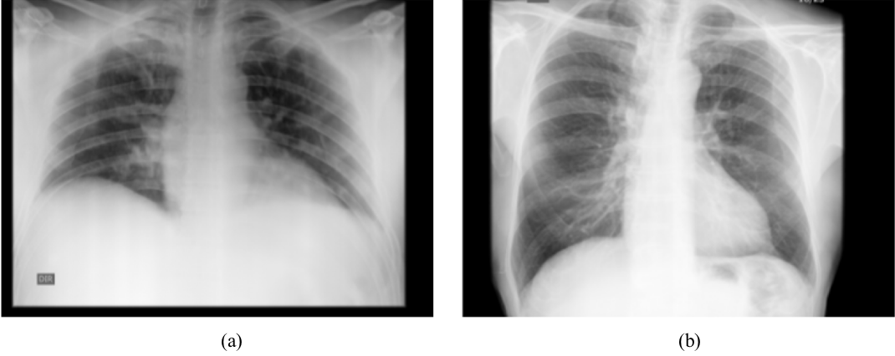

# HCV-UFPR COVID-19 Xray dataset

This dataset, called HCV-UFPR COVID-19 Xray dataset was introducted in [our RBE](https://doi.org/10.1007/s42600-021-00151-6) paper.

Brazil is one of the countries most affected by covid-19, with over 6 million confirmed cases, to date.
The Hospital da Cruz Vermelha from Curitiba, located in the state of Paraná, southern Brazil, received and documented some of those cases.
The data collection consists of 281 X-ray images of people infected with COVID-19 and 232 of people who obtained negative results that are not infected.
All images have 3 eight-bit color channels (RGB) and image resolution ranges from 2974 × 2612 to 4248 × 3480 pixels. 
The images are labeled in two classes, COVID-19 and non-COVID, and there are no annotations regarding the image angle view. 
The dataset is private, but it can be made available upon request.

Here are some examples from the dataset:  

Note: (a) X-ray of a
subject infected with COVID-19.
(b) X-ray of a subject without
COVID-19.
<br>

## How to obtain the Dataset

The HCV-UFPR COVID-19 Xray dataset is released for academic research only and is free to researchers from educational or research institutes for **non-commercial purposes**. 

To be able to download the dataset, please read carefully [**this license agreement**](./pdfs/license-agreement.pdf), fill it out and send it back to Professor David Menotti ([menotti@inf.ufpr.br](mailto:menotti@inf.ufpr.br)). **Your e-mail must be sent from a valid university account** (.edu, .ac or similar).

In general, a download link will take 1-3 business days to issue. Failure to follow the instructions may result in no response.

## Citation

If you use the HCV-UFPR COVID-19 Xray dataset in your research, please cite our paper:

* Eduardo Luz, Pedro Silva, Rodrigo Silva, Ludmila Silva, João Guimarães, Gustavo Miozzo, Gladston Moreira, and David Menotti, “Towards an effective and efficient deep learning model for COVID-19 patterns detection in X-ray images” in Research on Biomedical Engineering (RBE), April 2021, pp. 1–14, doi: https://doi.org/10.1007/s42600-021-00151-6.

```
@article{luz:2021,
  title = {Towards an effective and efficient deep learning model for COVID-19 patterns detection in X-ray images},
  author = {Eduardo Luz, Pedro Silva, Rodrigo Silva, Ludmila Silva, João Guimarães, Gustavo Miozzo, Gladston Moreira, and David Menotti},
  year = {2021},
  month = {April},
  journal = {Research on Biomedical Engineering (RBE)},
  volume = {},
  number = {},
  pages = {1-14},
  doi = {10.1007/s42600-021-00151-6},
  issn={2446-4740},
}
```

## Contact

Please contact David Menotti ([menotti@inf.ufpr.br](mailto:menotti@inf.ufpr.br)) with questions or comments.
